# ⚡ Cloud-Native Real-Time Transaction Processing & Fraud Detection Platform

> **A production-style AWS + Kubernetes project that processes transactions asynchronously, detects fraud in real time, auto-scales under load, self-heals failed pods, and ships through an automated CI/CD pipeline.**

<p align="center">
  <strong>FastAPI</strong> • <strong>Kafka</strong> • <strong>MySQL</strong> • <strong>Docker</strong> • <strong>Kubernetes</strong> • <strong>AWS EKS</strong> • <strong>Terraform</strong> • <strong>GitHub Actions</strong> • <strong>Prometheus</strong> • <strong>Grafana</strong>
</p>

---

## 🚀 Why this project?

This project is designed to demonstrate **real cloud-engineering skills**, not just a locally running API.

It combines:

- ☁️ AWS infrastructure and networking
- 🐳 Containerized microservices
- ☸️ Kubernetes orchestration on Amazon EKS
- 📨 Event-driven transaction processing with Kafka
- 🛡️ Rule-based fraud detection
- 📈 Horizontal Pod Autoscaling
- ♻️ Kubernetes self-healing
- 📊 Prometheus + Grafana observability
- 🔄 GitHub Actions CI/CD
- 🏗️ Terraform Infrastructure as Code

### 🎯 Portfolio outcome

A transaction enters the platform, is persisted and processed asynchronously, evaluated by the Fraud Engine, and receives a final decision such as:

```text
Normal transaction       → APPROVED
High-value fraud test    → FRAUD
```

The complete flow was tested on the deployed AWS/EKS environment.

---

# 🏗️ Architecture

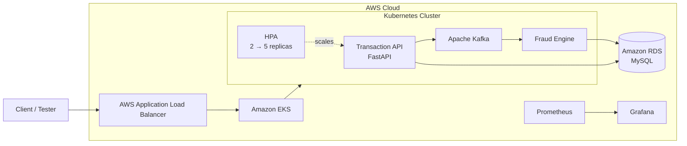

### 🔄 End-to-end transaction flow

```text
Client
  │
  ▼
AWS Load Balancer
  │
  ▼
Transaction API
  │
  ├──────────────► MySQL / RDS
  │
  ▼
Kafka
  │
  ▼
Fraud Engine
  │
  ▼
APPROVED / FRAUD
  │
  ▼
MySQL / RDS
```

---

# 🧩 Core Components

| Component | Role |
|---|---|
| **FastAPI** | REST transaction API |
| **MySQL / Amazon RDS** | Transaction persistence |
| **Apache Kafka** | Asynchronous event processing |
| **Fraud Engine** | Fraud-rule evaluation |
| **Docker** | Container packaging |
| **Amazon EKS** | Kubernetes orchestration |
| **Amazon ECR** | Container image registry |
| **Terraform** | AWS Infrastructure as Code |
| **GitHub Actions** | CI/CD automation |
| **Kubernetes HPA** | Automatic API scaling |
| **Prometheus** | Metrics collection |
| **Grafana** | Monitoring dashboards |
| **AWS ALB** | External application access |


---

# 🛡️ Fraud Detection Demo

The platform was tested with both normal and suspicious transactions.

### Normal transaction

```json
{
  "user_id": "user123",
  "amount": 5000,
  "merchant": "Amazon",
  "location": "Mumbai",
  "device_id": "device123"
}
```

Result:

```text
APPROVED
```

### Fraud test

```text
Amount:    150000
Merchant:  FraudDemo
Location:  Mumbai

Result:    FRAUD
```

The fraud decision was also verified in the MySQL database after processing.

---

# ☸️ Kubernetes in Action

The application runs in the `fraud-platform` namespace.

### Current validated cluster state

```text
EKS worker nodes        3/3 Ready
Transaction API         2 replicas Running
Fraud Engine            Running
Kafka                   Running
Prometheus              Running
Grafana                 Running
Metrics Server          Running
Alertmanager            Running
```

### Horizontal Pod Autoscaling

```text
Minimum replicas: 2
Maximum replicas: 5
CPU target:       70%
```

A load test was performed against the Transaction API.

```text
             Load increases
                    │
                    ▼
              CPU increases
                    │
                    ▼
             HPA scales up
                    │
                 2 → 5
                    │
                    ▼
              Load decreases
                    │
                    ▼
             HPA scales down
                    │
                 5 → 2
```

### ♻️ Self-healing demonstration

A Transaction API pod was intentionally deleted during testing.

Kubernetes automatically created a replacement pod through the Deployment controller.

```text
Pod deleted
    ↓
Deployment detects missing replica
    ↓
Replacement pod created
    ↓
Application returns to desired state
```

---

# 📊 Observability

The platform uses a Prometheus + Grafana monitoring stack.

```text
Kubernetes workloads
        │
        ▼
   Prometheus
        │
        ▼
     Grafana
```

Monitoring components:

- Prometheus
- Grafana
- Alertmanager
- kube-state-metrics
- node-exporter
- Metrics Server
- kube-prometheus operator

Grafana was validated against the `fraud-platform` namespace and used to inspect Kubernetes workload metrics and CPU utilization.

---

# 🔄 CI/CD Pipeline

Every push to `main` can trigger the GitHub Actions deployment workflow.

```text
Git Push
   │
   ▼
GitHub Actions
   │
   ├── Checkout source
   ├── Configure AWS OIDC
   ├── Install dependencies
   ├── Verify AWS access
   ├── Build API image
   ├── Build Fraud Engine image
   ├── Push images to ECR
   ├── Configure kubectl
   ├── Deploy to EKS
   ├── Verify rollout
```

### ✅ Deployment validation

The final CI/CD workflow completed successfully.

The pipeline demonstrated:

```text
GitHub
   ↓
GitHub Actions
   ↓
Amazon ECR
   ↓
Amazon EKS
   ↓
Kubernetes rollout
   ↓
Deployment verification
```

---

# 🏗️ AWS Infrastructure

Terraform provisions the core AWS infrastructure:

```text
AWS VPC
├── Public Subnet A
├── Public Subnet B
├── Private Subnet A
├── Private Subnet B
├── Internet Gateway
├── NAT Gateway
├── Security Groups
├── Application Load Balancer
└── Amazon RDS MySQL
```

The EKS cluster is configured separately using `eksctl`.

### AWS region

```text
ap-south-1
```

### Security design

- ALB accepts HTTP traffic.
- Application traffic is restricted to the application security group.
- RDS is private.
- MySQL access is restricted to approved application/EKS security groups.
- GitHub Actions uses OIDC rather than storing long-lived AWS access keys in the workflow.

---

# 📁 Project Structure

```text
cloud-native-fraud-platform/
│
├── transaction-api/
│   ├── app/
│   │   ├── main.py
│   │   ├── schemas.py
│   │   ├── routes.py
│   │   ├── database.py
│   │   ├── crud.py
│   │   ├── config.py
│   │   └── kafka_producer.py
│   ├── requirements.txt
│   └── Dockerfile
│
├── fraud-engine/
│   ├── app/
│   │   ├── main.py
│   │   ├── rules.py
│   │   └── database.py
│   ├── requirements.txt
│   └── Dockerfile
│
├── k8s/
│   ├── namespace.yaml
│   ├── api-deployment.yaml
│   ├── api-service.yaml
│   ├── fraud-engine-deployment.yaml
│   ├── kafka-deployment.yaml
│   └── kafka-service.yaml
│
├── terraform/
│   ├── main.tf
│   └── variables.tf
│
├── .github/
│   └── workflows/
│       └── ci-cd.yml
│
├── docker-compose.yml
├── eks-cluster.yaml
├── eks-policy.json
├── github-actions-trust-policy.json
├── transaction.json
├── fraud-test.json
└── README.md
```

---

# 🧪 Validation Results

| Test | Result |
|---|---|
| Transaction API health | ✅ Passed |
| AWS Load Balancer health | ✅ Passed |
| MySQL/RDS persistence | ✅ Passed |
| Kafka processing | ✅ Passed |
| Fraud Engine | ✅ Passed |
| `APPROVED` transaction | ✅ Verified |
| `FRAUD` transaction | ✅ Verified |
| EKS nodes | ✅ 3/3 Ready |
| Kubernetes workloads | ✅ Running |
| HPA scale-up | ✅ Demonstrated |
| HPA scale-down | ✅ Demonstrated |
| Pod self-healing | ✅ Demonstrated |
| Prometheus | ✅ Running |
| Grafana | ✅ Running |
| GitHub Actions | ✅ Successful |
| ECR image push | ✅ Successful |
| EKS deployment | ✅ Successful |


---

# 📸 Project Evidence

The following screenshots document the platform from local validation through AWS deployment and cloud infrastructure verification.

## 💻 Local & Kubernetes Validation

### EKS Nodes Ready
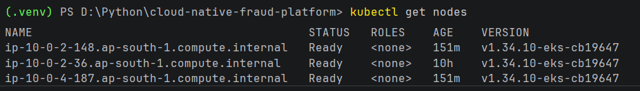

### Kubernetes Pods Healthy
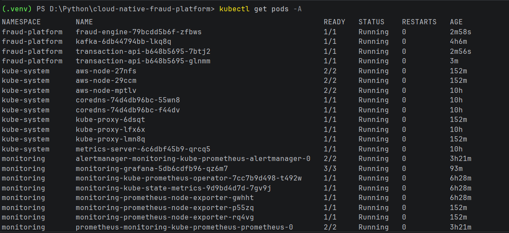

### HPA Autoscaling
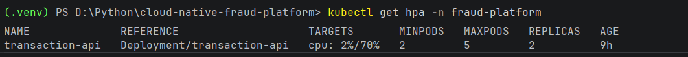

### Grafana Monitoring
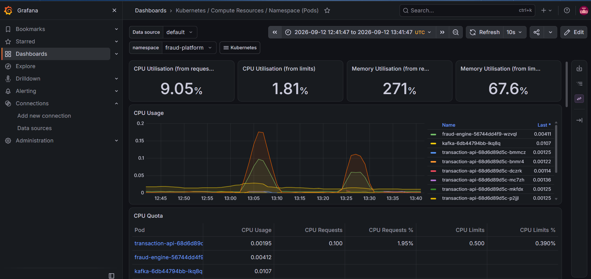

### Fraud Engine Result
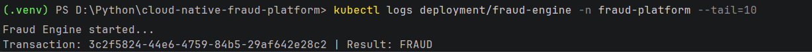

### MySQL Fraud & Approved Results
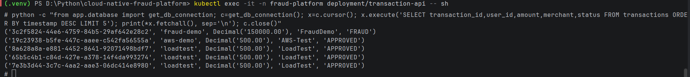

### GitHub Actions CI/CD
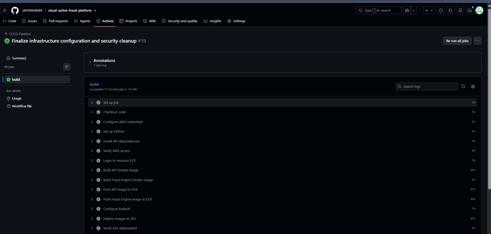

### AWS Load Balancer Health
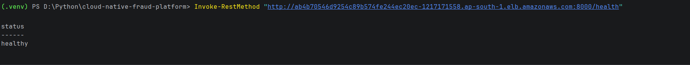

### Project Structure
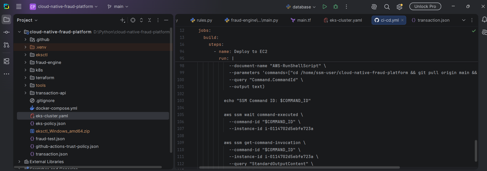

### GitHub Repository
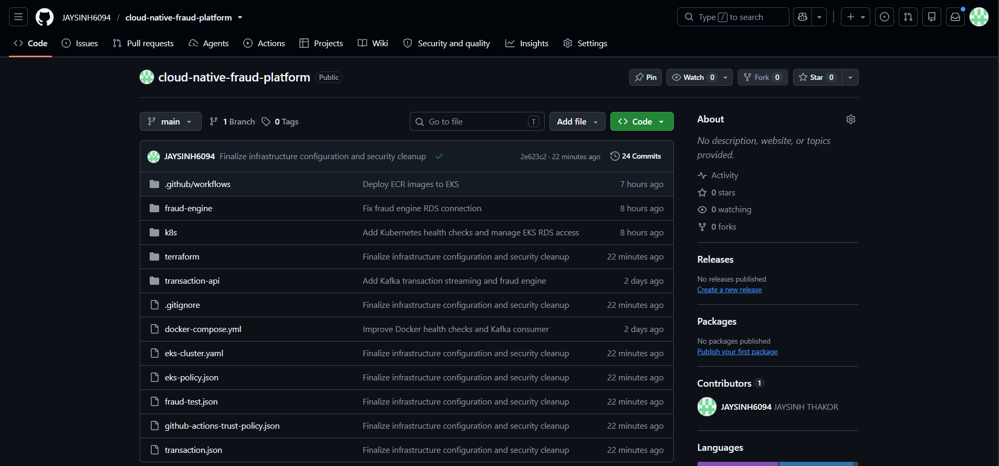

## ☁️ AWS Console Evidence

### Amazon EKS Cluster
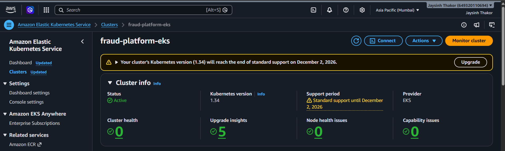

### EKS Managed Node Group
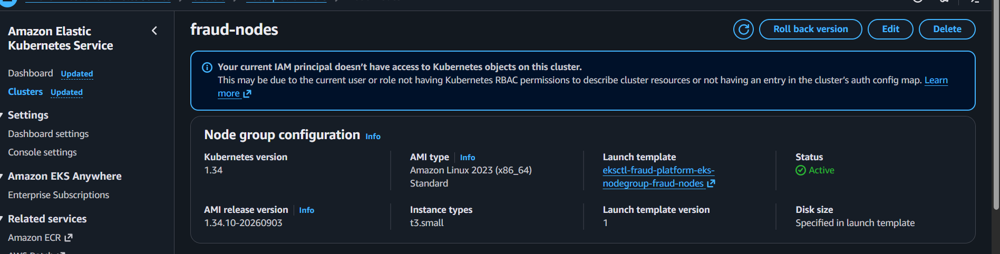


### Amazon RDS MySQL
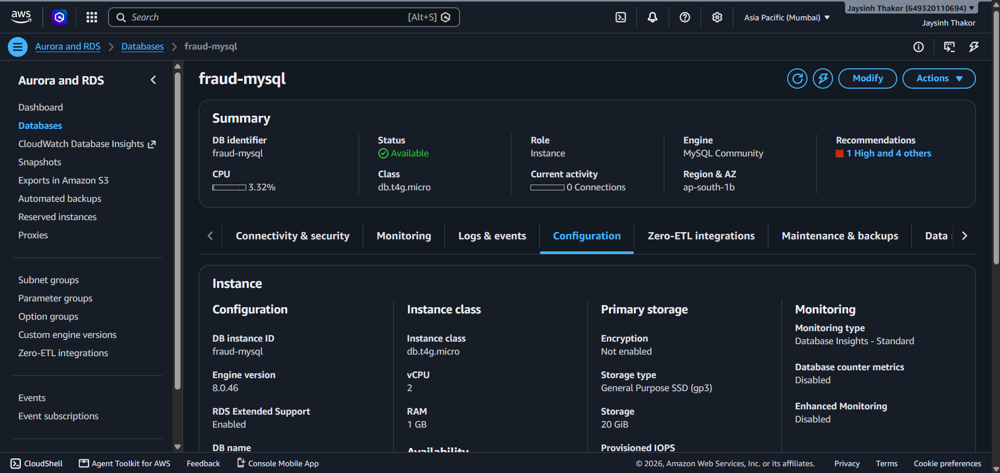

### Application Load Balancer
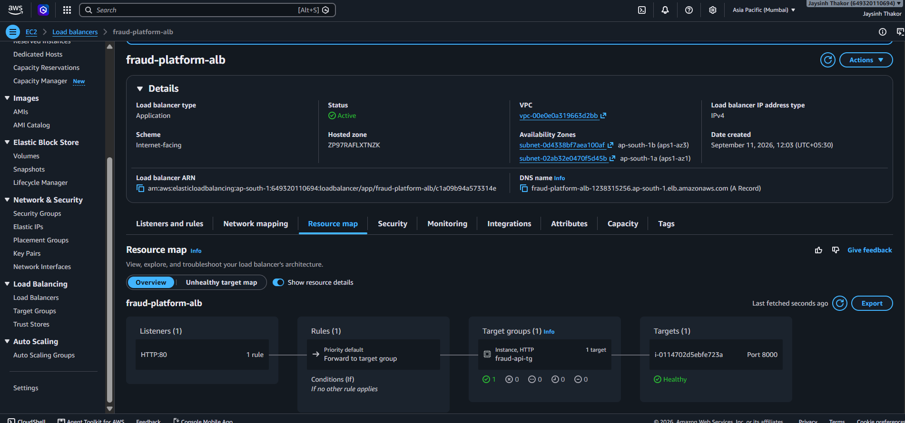

### Amazon ECR
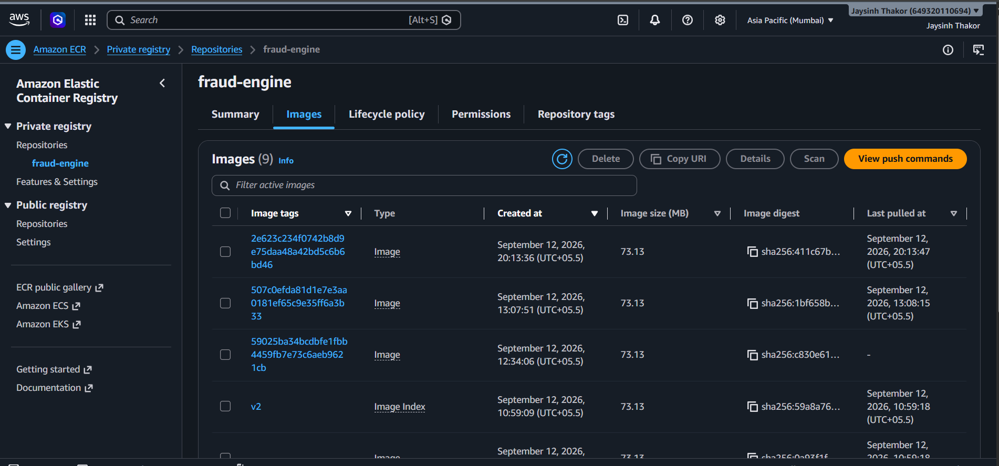

---

# 🛠️ Run Locally

### 1. Clone

```bash
git clone https://github.com/JAYSINH6094/cloud-native-fraud-platform.git
cd cloud-native-fraud-platform
```

### 2. Create Python environment

```powershell
python -m venv .venv
.venv\Scripts\Activate.ps1
```

### 3. Install API dependencies

```powershell
pip install -r transaction-api/requirements.txt
```

### 4. Start the containerized stack

```powershell
docker compose up --build
```

---

# ☁️ Kubernetes Access

Configure AWS/EKS access:

```powershell
aws eks update-kubeconfig --region ap-south-1 --name fraud-platform-eks
```

Check nodes:

```powershell
kubectl get nodes
```

Check application:

```powershell
kubectl get pods -n fraud-platform
```

Check autoscaling:

```powershell
kubectl get hpa -n fraud-platform
```

---

# 📈 Grafana Access

Forward Grafana locally:

```powershell
kubectl port-forward -n monitoring svc/monitoring-grafana 3000:80
```

Open:

```text
http://localhost:3000
```

Select the `fraud-platform` namespace in the Kubernetes dashboard.

---

# 🔐 Security

The repository is prepared for public portfolio sharing.

- Secrets are not stored in Git.
- Terraform database password is supplied through a sensitive variable.
- `.env` files are ignored.
- Terraform state files are ignored.
- Local executable tools are ignored.
- Public example infrastructure files use placeholders where appropriate.
- GitHub Actions uses OIDC for AWS authentication.

> **Before deploying your own copy, supply your own AWS account, networking IDs, secrets, and runtime configuration.**

---

# 🎓 What This Project Demonstrates

This project is especially relevant to **Cloud Engineer, DevOps Engineer, Platform Engineer, and Cloud/DevOps-focused Backend Engineer** roles.

### Cloud & Infrastructure

- AWS VPC
- Subnets and routing
- Security Groups
- RDS
- ALB
- ECR
- EKS
- IAM/OIDC
- Terraform

### DevOps

- Docker
- Kubernetes
- GitHub Actions
- CI/CD
- HPA
- Self-healing
- Infrastructure as Code
- Monitoring

### Backend & Distributed Systems

- Python
- FastAPI
- REST APIs
- MySQL
- Kafka
- Event-driven processing
- Fraud detection

---

# 🔮 Future Improvements

- HTTPS with ACM and a custom domain
- AWS Secrets Manager or Kubernetes Secrets for runtime credentials
- More advanced fraud rules and ML-based scoring
- Production-grade Kafka persistence
- Centralized logging
- Distributed tracing
- Automated Terraform deployment
- Multi-AZ database configuration
- Disaster-recovery automation
- More comprehensive automated tests

---

## ⭐ Project Highlights

```text
┌──────────────────────────────────────────────────────┐
│          CLOUD-NATIVE FRAUD PLATFORM                 │
├──────────────────────────────────────────────────────┤
│                                                      │
│  ⚡ FastAPI          📨 Kafka        🛡️ Fraud Engine │
│  🐳 Docker           ☸️ EKS          🏗️ Terraform    │
│  🔄 CI/CD            📈 HPA          📊 Grafana      │
│  🗄️ RDS MySQL        🔍 Prometheus   ⚖️ ALB          │
│                                                      │
│       Real-time processing + cloud automation       │
│                                                      │
└──────────────────────────────────────────────────────┘
```

---

## 👨‍💻 Author

**JAYSINH THAKOR**

GitHub: **[@JAYSINH6094](https://github.com/JAYSINH6094)**

---

> **Built as a hands-on cloud engineering portfolio project focused on AWS, Kubernetes, automation, observability, and distributed transaction processing.**
