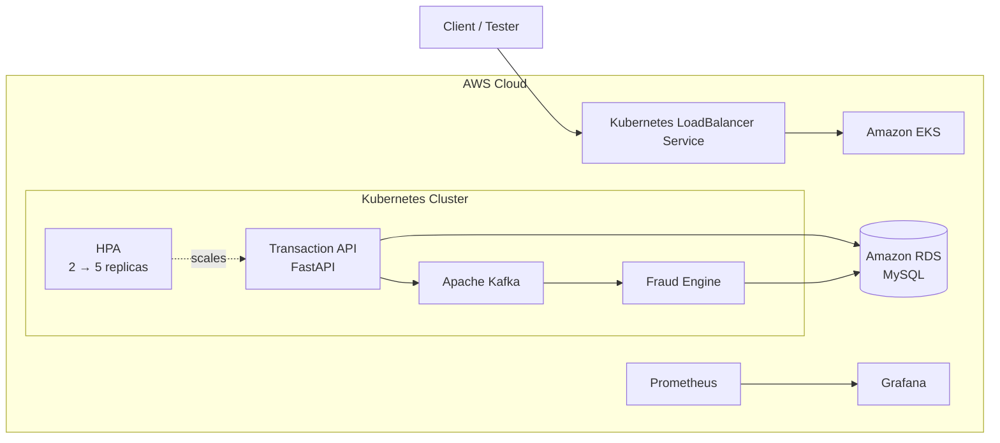
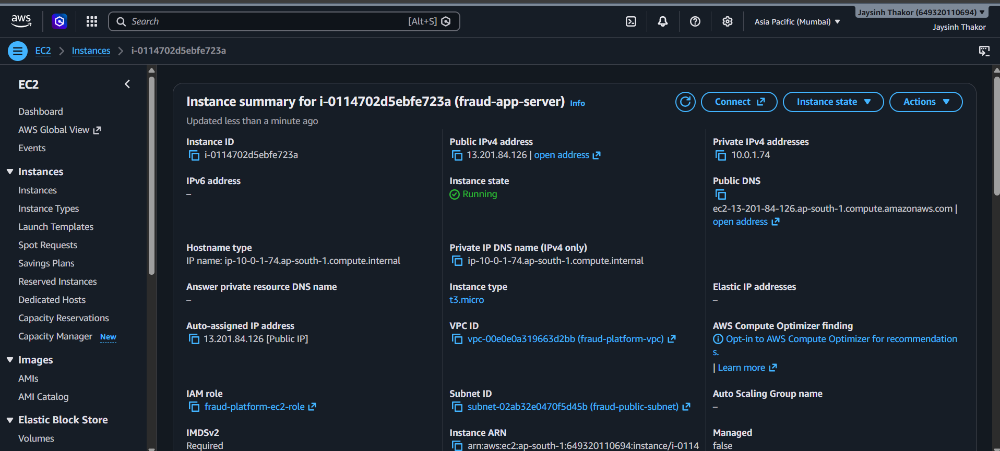

<div align="center">

# ⚡ Cloud-Native Real-Time Transaction Processing & Fraud Detection Platform

### Real-time transactions • Event-driven fraud detection • Kubernetes • AWS

<p>
  
  
  
  
</p>
<p>
  
  
  
  
  
</p>

> **A production-style cloud engineering portfolio project that processes transactions asynchronously, evaluates fraud in real time, scales with Kubernetes, and automates delivery through CI/CD.**

<p>
  <a href="#-architecture">🏗️ Architecture</a> •
  <a href="#-screenshots--deployment-evidence">📸 Evidence</a> •
  <a href="#-fraud-detection-demo">🛡️ Fraud Demo</a> •
  <a href="#-run-locally">🛠️ Run Locally</a>
</p>

</div>

---

## 🚀 Why this project?

This project is designed to demonstrate **real cloud-engineering skills**, not just a locally running API.

It combines:

- ☁️ AWS infrastructure and networking
- 🐳 Containerized microservices
- ☸️ Kubernetes orchestration on Amazon EKS
- 📨 Event-driven transaction processing with Kafka
- 🛡️ Rule-based fraud detection
- 📈 Horizontal Pod Autoscaling
- ♻️ Kubernetes self-healing
- 📊 Prometheus + Grafana observability
- 🔄 GitHub Actions CI/CD
- 🏗️ Terraform Infrastructure as Code

### 🎯 Portfolio outcome

A transaction enters the platform, is persisted and processed asynchronously, evaluated by the Fraud Engine, and receives a final decision:

```text
Normal transaction       → APPROVED
High-value fraud test    → FRAUD
```

The complete transaction flow was previously deployed and validated on AWS/EKS. The AWS resources were subsequently removed to avoid unnecessary cloud costs. The Terraform and EKS configuration remain available for future deployment.

<details>
<summary><strong>📌 Project at a glance</strong></summary>

| Area | Implementation |
|---|---|
| API | FastAPI + Python |
| Event streaming | Apache Kafka |
| Fraud processing | Dedicated rule-based Fraud Engine |
| Database | MySQL / Amazon RDS |
| Containers | Docker |
| Orchestration | Kubernetes / Amazon EKS |
| Registry | Amazon ECR |
| Infrastructure | Terraform |
| CI/CD | GitHub Actions + AWS OIDC |
| Scaling | Kubernetes HPA |
| Observability | Prometheus + Grafana |

</details>

---

# 🏗️ Architecture



### 🔄 End-to-end transaction flow

```text
Client
  │
  ▼
Kubernetes LoadBalancer Service
  │
  ▼
Transaction API
  │
  ├──────────────► MySQL / RDS
  │
  ▼
Kafka
  │
  ▼
Fraud Engine
  │
  ▼
APPROVED / FRAUD
  │
  ▼
MySQL / RDS
```

---

# 🧩 Core Components

| Component | Role |
|---|---|
| **FastAPI** | REST transaction API |
| **MySQL / Amazon RDS** | Transaction persistence |
| **Apache Kafka** | Asynchronous event processing |
| **Fraud Engine** | Fraud-rule evaluation |
| **Docker** | Container packaging |
| **Amazon EKS** | Kubernetes orchestration |
| **Amazon ECR** | Container image registry |
| **Terraform** | AWS Infrastructure as Code |
| **GitHub Actions** | CI/CD automation |
| **Kubernetes HPA** | Automatic API scaling |
| **Prometheus** | Metrics collection |
| **Grafana** | Monitoring dashboards |
| **Kubernetes LoadBalancer Service** | External application access |

---

# 📸 Screenshots & Deployment Evidence

> The evidence below is grouped for fast portfolio review: **PowerShell/Kubernetes validation first**, followed by **historical AWS deployment evidence**. The AWS environment was later cleaned up to avoid unnecessary costs.

## 1️⃣ PowerShell / Kubernetes Validation

<table>
<tr>
<td width="50%">
<strong>☸️ EKS Nodes Ready</strong><br><br>

</td>
<td width="50%">
<strong>🟢 Kubernetes Pods Healthy</strong><br><br>

</td>
</tr>
<tr>
<td>
<strong>📈 HPA Autoscaling</strong><br><br>

</td>
<td>
<strong>📊 Grafana Monitoring</strong><br><br>

</td>
</tr>
<tr>
<td>
<strong>🛡️ Fraud Engine Result</strong><br><br>

</td>
<td>
<strong>🗄️ MySQL Fraud & Approved Results</strong><br><br>

</td>
</tr>
<tr>
<td>
<strong>🔄 GitHub Actions CI/CD</strong><br><br>

</td>
<td>
<strong>❤️ Load Balancer Health</strong><br><br>

</td>
</tr>
<tr>
<td>
<strong>📁 Project Structure</strong><br><br>

</td>
<td>
<strong>🐙 GitHub Repository</strong><br><br>

</td>
</tr>
</table>

## 2️⃣ ☁️ Historical AWS Deployment Evidence

<table>
<tr>
<td width="50%">
<strong>☁️ Amazon EKS Cluster</strong><br><br>

</td>
<td width="50%">
<strong>☸️ EKS Node Groups</strong><br><br>

</td>
</tr>
<tr>
<td>
<strong>🗄️ Amazon RDS MySQL</strong><br><br>

</td>
<td>
<strong>⚖️ AWS Load Balancer</strong><br><br>

</td>
</tr>
<tr>
<td>
<strong>📦 Amazon ECR Images</strong><br><br>

</td>
<td>
<strong>🖥️ Historical EC2 Evidence</strong><br><br>

</td>
</tr>
</table>

---

# 🛡️ Fraud Detection Demo

The platform was tested with both normal and suspicious transactions.

### Normal transaction

```json
{
  "user_id": "user123",
  "amount": 5000,
  "merchant": "Amazon",
  "location": "Mumbai",
  "device_id": "device123"
}
```

Result:

```text
APPROVED
```

### Fraud test

```text
Amount:    150000
Merchant:  FraudDemo
Location:  Mumbai

Result:    FRAUD
```

The fraud decision was also verified in the MySQL database after processing.

### Fraud rules

The current rule-based engine marks a transaction as `FRAUD` when:

- Amount is greater than `100000`
- Location is `Unknown` or `Blacklisted`
- Device ID is `UNKNOWN` or `BLACKLISTED`

Otherwise, the transaction is marked `APPROVED`.

---

# ☸️ Kubernetes in Action

The application runs in the `fraud-platform` namespace.

### Previously validated AWS/EKS cluster state

> The following represents the previously deployed AWS/EKS environment used for validation. The AWS resources are not currently running.

```text
EKS worker nodes        3/3 Ready
Transaction API         2 replicas Running
Fraud Engine            Running
Kafka                   Running
Prometheus              Running
Grafana                 Running
Metrics Server          Running
Alertmanager            Running
```

### Horizontal Pod Autoscaling

```text
Minimum replicas: 2
Maximum replicas: 5
CPU target:       70%
```

A load test was performed against the Transaction API.

```text
              Load increases
                     │
                     ▼
               CPU increases
                     │
                     ▼
              HPA scales up
                     │
                  2 → 5
                     │
                     ▼
               Load decreases
                     │
                     ▼
              HPA scales down
                     │
                  5 → 2
```

### ♻️ Self-healing demonstration

A Transaction API pod was intentionally deleted during testing.

Kubernetes automatically created a replacement pod through the Deployment controller.

```text
Pod deleted
    ↓
Deployment detects missing replica
    ↓
Replacement pod created
    ↓
Application returns to desired state
```

---

# 📊 Observability

Prometheus and Grafana were used during the previous AWS/EKS deployment to inspect Kubernetes workload and CPU metrics.

```text
Kubernetes workloads
        │
        ▼
   Prometheus
        │
        ▼
     Grafana
```

Monitoring components validated during the previous deployment included:

- Prometheus
- Grafana
- Alertmanager
- kube-state-metrics
- node-exporter
- Metrics Server
- kube-prometheus operator

---

# 🔄 CI/CD Pipeline

The repository contains a GitHub Actions workflow designed to build, publish, and deploy the application to AWS/EKS.

```text
Git Push
   │
   ▼
GitHub Actions
   │
   ├── Checkout source
   ├── Configure AWS OIDC
   ├── Install dependencies
   ├── Run validation
   ├── Verify AWS infrastructure prerequisites
   ├── Verify AWS access
   ├── Login to ECR
   ├── Build API image
   ├── Build Fraud Engine image
   ├── Push images to ECR
   ├── Configure kubectl
   ├── Deploy Kubernetes manifests
   ├── Configure HPA
   ├── Verify rollout
   └── Verify deployments, pods and services
```

### 🔐 GitHub Actions authentication

The workflow uses **AWS OIDC** rather than storing long-lived AWS access keys in GitHub Actions secrets.

### ✅ Historical deployment validation

The GitHub Actions workflow was successfully used during the previous live AWS/EKS deployment.

The pipeline demonstrated:

```text
GitHub
   ↓
GitHub Actions
   ↓
Amazon ECR
   ↓
Amazon EKS
   ↓
Kubernetes rollout
   ↓
Deployment verification
```

The AWS environment is currently cleaned up to avoid unnecessary cloud costs. The workflow remains available for a future deployment.

---

# 🏗️ AWS Infrastructure

Terraform provisions the core AWS infrastructure:

```text
AWS VPC
├── Public Subnet A
├── Public Subnet B
├── Private Subnet A
├── Private Subnet B
├── Internet Gateway
├── NAT Gateway
├── Security Groups
├── Amazon RDS MySQL
├── Amazon ECR: fraud-api
└── Amazon ECR: fraud-engine
```

The EKS cluster is configured separately using `eksctl`.

External application access is provided through the Kubernetes `LoadBalancer` Service, which creates the required AWS load-balancing resource when the cluster is deployed.

### AWS region

```text
ap-south-1
```

### Security design

- RDS is deployed privately.
- MySQL access is restricted to the application/EKS security configuration.
- Terraform database credentials are supplied through a sensitive variable.
- Secrets are not committed to Git.
- GitHub Actions uses OIDC for AWS authentication.
- Public infrastructure templates use placeholders where appropriate.
- Terraform state and local configuration files are excluded from version control.

---

# 📁 Project Structure

```text
cloud-native-fraud-platform/
│
├── transaction-api/
│   ├── app/
│   │   ├── main.py
│   │   ├── schemas.py
│   │   ├── routes.py
│   │   ├── database.py
│   │   ├── crud.py
│   │   ├── config.py
│   │   └── kafka_producer.py
│   ├── requirements.txt
│   └── Dockerfile
│
├── fraud-engine/
│   ├── app/
│   │   ├── main.py
│   │   ├── rules.py
│   │   └── database.py
│   ├── requirements.txt
│   └── Dockerfile
│
├── mysql/
│   └── init.sql
│
├── k8s/
│   ├── namespace.yaml
│   ├── api-deployment.yaml
│   ├── api-service.yaml
│   ├── fraud-engine-deployment.yaml
│   ├── kafka-deployment.yaml
│   ├── kafka-service.yaml
│   └── hpa.yaml
│
├── terraform/
│   ├── main.tf
│   └── variables.tf
│
├── tests/
│   └── test_fraud_rules.py
│
├── .github/
│   └── workflows/
│       └── ci-cd.yml
│
├── docker-compose.yml
├── requirements-dev.txt
├── eks-cluster.yaml
├── eks-policy.json
├── github-actions-trust-policy.json
├── transaction.json
├── fraud-test.json
└── README.md
```

---

# 🧪 Validation Results

> **Portfolio evidence:** the results below record the previously validated AWS/EKS deployment. The cloud resources were later destroyed after testing.


| Test | Result | Validation |
|---|---|---|
| Transaction API health | ✅ Passed | Local + historical AWS |
| MySQL persistence | ✅ Passed | Local + historical RDS |
| Kafka processing | ✅ Passed | Local + historical AWS |
| Fraud Engine | ✅ Passed | Local + historical AWS |
| `APPROVED` transaction | ✅ Verified | Local + historical AWS |
| `FRAUD` transaction | ✅ Verified | Local + historical AWS |
| Automated fraud-rule tests | ✅ 4/4 Passed | Local pytest |
| Docker Compose stack | ✅ Passed | Local |
| MySQL schema initialization | ✅ Passed | Local |
| EKS nodes | ✅ 3/3 Ready | Historical AWS |
| Kubernetes workloads | ✅ Running | Historical AWS |
| HPA scale-up | ✅ Demonstrated | Historical AWS |
| HPA scale-down | ✅ Demonstrated | Historical AWS |
| Pod self-healing | ✅ Demonstrated | Historical AWS |
| Prometheus | ✅ Running | Historical AWS |
| Grafana | ✅ Running | Historical AWS |
| GitHub Actions | ✅ Successful | Historical deployment |
| ECR image push | ✅ Successful | Historical deployment |
| EKS deployment | ✅ Successful | Historical deployment |

---

# 🛠️ Run Locally

### 1. Clone

```powershell
git clone https://github.com/JAYSINH6094/cloud-native-fraud-platform.git
cd cloud-native-fraud-platform
```

### 2. Create Python environment

```powershell
python -m venv .venv
.venv\Scripts\Activate.ps1
```

### 3. Install dependencies

```powershell
pip install -r transaction-api/requirements.txt
pip install -r requirements-dev.txt
```

### 4. Start the containerized stack

```powershell
docker compose up --build
```

The local stack includes:

```text
MySQL
Kafka
Transaction API
Fraud Engine
```

The MySQL schema is automatically initialized from:

```text
mysql/init.sql
```

### 5. Test API health

```powershell
Invoke-RestMethod http://localhost:8000/health
```

Expected:

```json
{
  "status": "healthy"
}
```

### 6. Run automated tests

```powershell
python -m pytest .\tests -v
```

### 7. Stop the local stack

```powershell
docker compose down -v
```

---

# ☁️ Kubernetes Access

When the AWS infrastructure is deployed:

```powershell
aws eks update-kubeconfig --region ap-south-1 --name fraud-platform-eks
```

Check nodes:

```powershell
kubectl get nodes
```

Check application:

```powershell
kubectl get pods -n fraud-platform
```

Check services:

```powershell
kubectl get svc -n fraud-platform
```

Check autoscaling:

```powershell
kubectl get hpa -n fraud-platform
```

---

# 📈 Grafana Access

During the previous monitoring deployment, Grafana was accessed through Kubernetes port forwarding:

```powershell
kubectl port-forward -n monitoring svc/monitoring-grafana 3000:80
```

Open:

```text
http://localhost:3000
```

The `fraud-platform` namespace was used for inspecting Kubernetes workload and CPU metrics.

---

# 🔐 Security

The repository is prepared for public portfolio sharing.

- Secrets are not stored in Git.
- Terraform database password is supplied through a sensitive variable.
- `.env` files are ignored.
- Terraform state files are ignored.
- Local executable tools are ignored.
- Public infrastructure examples use placeholders where appropriate.
- GitHub Actions uses OIDC for AWS authentication.
- RDS is configured as a private database.
- AWS resources are not intentionally left running when the project is not being demonstrated.

> **Before deploying your own copy, supply your own AWS account, networking IDs, secrets, IAM configuration, and runtime configuration.**

---

# 🎓 What This Project Demonstrates

This project is especially relevant to:

- **Cloud Engineer**
- **DevOps Engineer**
- **Platform Engineer**
- **Cloud/DevOps-focused Backend Engineer**

### Cloud & Infrastructure

- AWS VPC
- Subnets and routing
- Internet Gateway
- NAT Gateway
- Security Groups
- RDS
- ECR
- EKS
- IAM/OIDC
- Terraform
- Kubernetes LoadBalancer Service

### DevOps

- Docker
- Kubernetes
- GitHub Actions
- CI/CD
- HPA
- Self-healing
- Infrastructure as Code
- Monitoring

### Backend & Distributed Systems

- Python
- FastAPI
- REST APIs
- MySQL
- Kafka
- Event-driven processing
- Asynchronous processing
- Fraud detection
- Containerized microservices

---

# 🔮 Future Improvements

- HTTPS with ACM and a custom domain
- AWS Secrets Manager or Kubernetes Secrets for runtime credentials
- More advanced fraud rules and ML-based scoring
- Production-grade Kafka persistence
- Centralized logging
- Distributed tracing
- Automated Terraform deployment
- Multi-AZ database configuration
- Disaster-recovery automation
- More comprehensive automated tests
- Production-grade observability and alerting
- Outbox pattern for stronger database-to-Kafka consistency

---

## ⭐ Project Highlights

```text
┌──────────────────────────────────────────────────────┐
│          CLOUD-NATIVE FRAUD PLATFORM                 │
├──────────────────────────────────────────────────────┤
│                                                      │
│  ⚡ FastAPI          📨 Kafka        🛡️ Fraud Engine │
│  🐳 Docker           ☸️ EKS          🏗️ Terraform    │
│  🔄 CI/CD            📈 HPA          📊 Grafana      │
│  🗄️ RDS MySQL        🔍 Prometheus   ⚖️ LoadBalancer │
│                                                      │
│       Real-time processing + cloud automation       │
│                                                      │
└──────────────────────────────────────────────────────┘
```

---

### 🧭 Why it stands out

This project demonstrates a complete cloud-engineering workflow rather than a single application feature:

**Build → Containerize → Stream → Detect → Persist → Deploy → Scale → Observe → Recover → Automate**

It is intentionally centered on cloud engineering, while the fraud rules provide a realistic workload for the distributed platform.

---

# 👨‍💻 Author

**JAYSINH THAKOR**

GitHub: **[@JAYSINH6094](https://github.com/JAYSINH6094)**

---

> **Built as a hands-on cloud engineering portfolio project focused on AWS, Kubernetes, automation, observability, CI/CD, and distributed transaction processing.**
